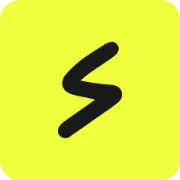

## Shakers skeleton: NestJS Fastify & Next.js

This repository is a Full-Stack Typescript skeleton with NestJS Fastify and Next.js, designed for
quickly getting started developing an API with frontend. Check the [Getting Started](#getting-started) for full details.

## Technologies

- [Typescript 5.7](https://www.typescriptlang.org/docs/handbook/release-notes/typescript-5-7.html)
- [Next.js 15.1](https://nextjs.org/)
- [NestJS 11.0](https://nestjs.com/)
- [Pnpm](https://pnpm.io/)
- [JEST](https://jestjs.io/es-ES/)
- [ESLint](https://eslint.org/)
- [Make](https://www.gnu.org/software/make/manual/make.html)

## Getting Started

Within the [Makefile](Makefile) you can handle the entire flow to get everything up & running:

1. Install `make` on your computer, if you do not already have it.
2. Install the pnpm dependencies: `make deps`
3. Start the application: `make start`

Once these steps are finished, you could access to the application visiting these two urls:

- Go to [http://localhost:3000](http://localhost:3000) to see that the Next.js webapp everything is up & running!
- Go to [http://localhost:8000](http://localhost:8000) to see that the NestJS API everything is up & running!

## Overview

This skeleton is based on
a [Clean Architecture](https://blog.cleancoder.com/uncle-bob/2012/08/13/the-clean-architecture.html) approach, so you
could find the first basic elements:

> You could [find here an amazing Dev.to article](https://dev.to/bespoyasov/clean-architecture-on-frontend-4311)
> explaining this Clean Architecture on frontend! (credits to [@bespoyasov\_](https://twitter.com/bespoyasov_)).

### UI layer

This folder contains the basic UI elements. You should add any UI element inside this folder, with the respective CSS
file module.

### Application layer

This layer is the one in charge of the different use cases of the application. A Use Case it's a workflow of what should
it happen to a concrete Domain entity once interacts with the application.

This is the layer which would use any external service and communicate with the world (ie. APIs, databases, etc...)

### Services layer

As we said, this is the layer that communicates the application with the outer world, and the one that would be coupled
with almost any 3rd party provider, framework, etc...

## Support

If you are having problems or need anything else, please let us know by
[raising a new issue](https://github.com/shakers-xyz/sh-verified-skeleton-nextjs-nestjs/issues/new/choose).

## Case study

### Problem

> Build a web app for the classic Tic Tac Toe game that allows users to register and log in, play either Player vs CPU or Player vs Player modes, and access a dashboard with game stats. The project must be Full Stack, using TypeScript, NestJS for the backend, and Next.js for the frontend. It should also include automated testing (Cypress for frontend and Jest for backend), a fully functional CI/CD pipeline via GitLab, and Dockerfiles to independently run both services.

---

### Overview

**Objective**

Develop a Full Stack solution for Tic Tac Toe with key features such as user authentication, game modes, stat tracking, and a results dashboard. The project will also include automated tests, a CI/CD pipeline, and Dockerization for both frontend and backend services.

**Key Features**

1. **User Registration/Login**: JWT-based authentication.
2. **Game Modes**:
   - Player vs CPU (logic handled via REST APIs).
   - Player vs Player (real-time gameplay via WebSockets).
3. **Dashboard**: A clean interface displaying player stats like wins, draws, and losses for each game mode.
4. **Dockerization**: Create Dockerfiles and a docker-compose setup for running backend and frontend services independently.
5. **Automated Deployment**: CI/CD pipeline using GitLab to deploy the app to a cloud environment.

---

### System Architecture

#### High-Level Overview

Use the [Mermaid editor](https://mermaid.live/) to see better the graph.

```
graph TD
    subgraph Frontend [Frontend Next.js]
        A[Register/Login] --> B[Lobby]
        B --> C[Game Board]
        B --> D[Dashboard]
    end

    subgraph Backend [Backend NestJS]
        E[API REST - Player vs CPU]
        F[WebSocket Gateway - Player vs Player]
        G[Stats Endpoint]
    end

    subgraph Database [Database MongoDB]
        H[Users]
        I[Games]
        J[Statistics]
    end

    subgraph Infrastructure [Infrastructure]
        K[GitLab CI/CD]
        L[Docker Compose]
    end

    %% Connections between frontend and backend
    A -->|Authentication| Backend
    C -->|REST Moves| E
    C -->|WebSocket Messages| F
    D -->|Request Data| G

    %% Connections between backend and database
    Backend -->|Save Results| I
    Backend -->|Fetch Statistics| J
    Backend -->|User Management| H

    %% Infrastructure connections
    Backend --> L
    Frontend --> L
    Database --> L
    K -->|Pipeline| L

```

#### Components

1. **Backend (NestJS)**:
   - Authentication via JWT.
   - Management of users, games, and stats.
   - WebSocket Gateway for Player vs Player games.
   - REST API for Player vs CPU games.
2. **Frontend (Next.js)**:
   - Responsive interfaces for login, game selection, gameplay, and stats dashboard.
   - Integration with APIs and WebSockets for smooth communication.
3. **MongoDB Database**:
   - Persistent storage for user data, game results, and stats.
4. **Testing**:
   - End-to-end tests for frontend with Cypress.
   - Unit and integration tests for backend with Jest.
5. **Dockerization**:
   - Separate Dockerfiles for backend and frontend.
   - A docker-compose.yml to spin up the entire stack (backend, frontend, and database).

---

### Detailed Component Specifications

#### Backend (NestJS)

- **Authentication**:
  - Implement user registration and login.
  - Secure sessions with JWT tokens.
- **REST API**:
  - Create endpoints to handle Player vs CPU game logic.
  - Handle moves and return game state updates.
- **WebSockets**:
  - Manage real-time connections for Player vs Player mode.
  - Broadcast moves and player status between clients.
- **Stats Management**:
  - API to fetch aggregated stats by player and game mode.
- **Testing**:
  - Write unit tests for game logic.
  - Add integration tests for APIs and WebSocket events.
- **Dockerization**:
  - Build and test a Dockerfile for the backend service.

#### Frontend (Next.js)

- **Authentication**:
  - Create user-friendly login and registration forms.
  - Manage session tokens for user authentication.
- **Game Lobby**:
  - Allow users to select Player vs CPU or Player vs Player modes.
  - Show a list of online players for matchmaking in Player vs Player mode.
- **Game Board**:
  - Build an interactive Tic Tac Toe game board component.
  - Display real-time turn indicators and game states.
- **Dashboard**:
  - Create a responsive table displaying stats for wins, losses, and draws.
- **Navigation**:
  - Enable seamless navigation across pages: Login → Lobby → Dashboard → Game.
- **Testing**:
  - Use Cypress to test key user flows like login, game selection, and gameplay.
- **Dockerization**:
  - Create a Dockerfile for the frontend.

---

### Expected Outcomes

By the end of the project, you’ll have:

1. A fully functional Tic Tac Toe game with Player vs CPU and Player vs Player modes.
2. A responsive and user-friendly interface with login, a game lobby, and a dashboard for stats.
3. Clean, modular, and well-documented code with comprehensive automated tests.
4. Dockerized services that can be easily deployed with docker-compose.
5. A CI/CD pipeline that automates testing and deployment to production.

## License

This project is licensed with the [MIT license](LICENSE).
